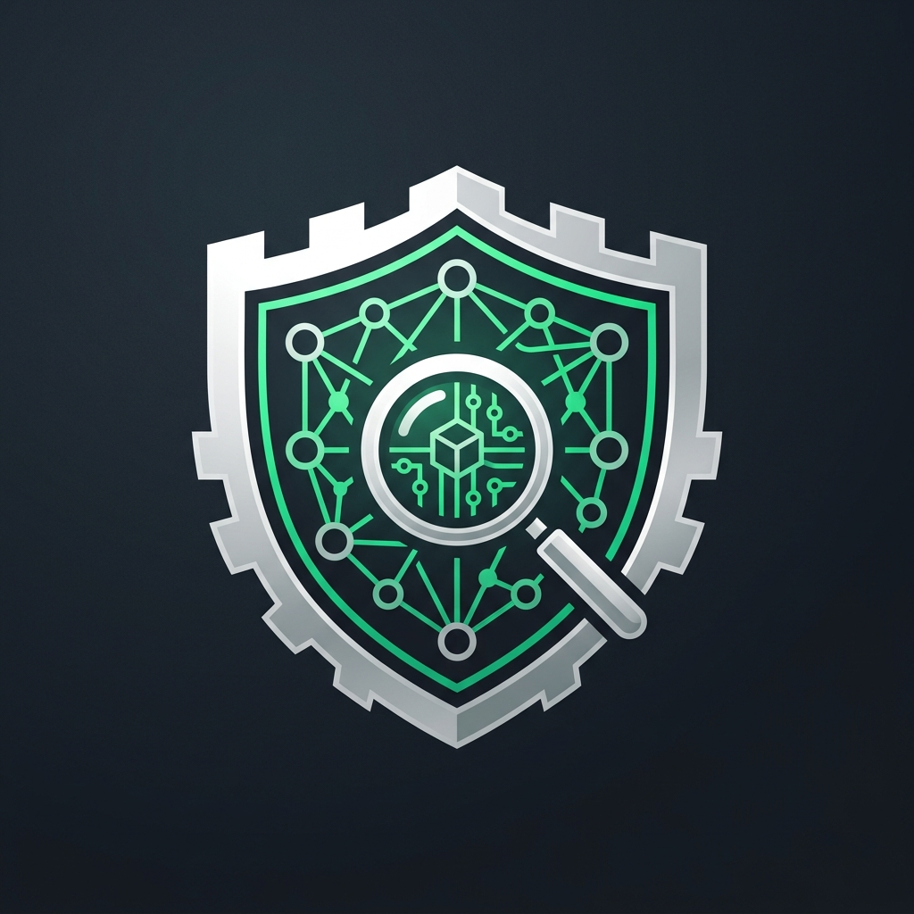

# AegisForensic LLM Guardrails OWASP & Forensics 

**Framework de Cumplimiento Normativo, Mitigación OWASP & Auditoría Forense de LLMs**

  <em>"Donde el cumplimiento regulatorio se encuentra con la eficiencia operativa: Un servidor de inspección en capas diseñado para que los modelos de lenguaje empresariales operen bajo un marco estricto, auditable, libre de fugas de privacidad y blindado contra alucinaciones factuales.."</em>

👉 **[Probar Aplicación de Gobernanza & Guardrails](https://86yanetc.github.io/gobernanza_guardrails/)**

## 📖 Glosario de Términos de Alta Ingeniería

**NIST AI RMF 1.0 (National Institute of Standards and Technology - Artificial Intelligence Risk Management Framework)**: Marco de Gestión de Riesgos de Inteligencia Artificial.

**GDPR (General Data Protection Regulation):** Reglamento General de Protección de Datos de la Unión Europea (en español, RGPD). Entró en vigor en 2018 y es el estándar de oro mundial para la privacidad en internet.

**HIPAA (Health Insurance Portability and Accountability Act):** Ley de Portabilidad y Responsabilidad del Seguro Médico de los Estados Unidos (promulgada en 1996).

## 💡 Preguntas Clave de Gobernanza y Mitigación de Riesgos

**1. ¿Por qué implementar un pipeline secuencial en capas en lugar de un único modelo de seguridad masivo?**

Ningún modelo de Inteligencia Artificial es 100% infalible ante ataques adversarios (Jailbreaks). Basar la seguridad en una sola capa expone a la organización a un punto único de falla. El pipeline en capas aplica el principio de Defensa en Profundidad (Defense in Depth) recomendado por el NIST AI RMF 1.0. Al segmentar el control (Fase 0: Sintáctica, Fase 1: Probabilística, Fase 2: Temática, Fase 3: Factual) garantizamos que si una inyección burla la primera barrera, sea capturada de forma redundante por las capas subsecuentes, minimizando el riesgo residual de la operación.

**2. ¿Cómo equilibra el sistema las exigencias estrictas de privacidad con la usabilidad del negocio?**

Un enfoque de cumplimiento normativo tradicional (como un cortafuegos rígido) bloquearía cualquier prompt que contenga un correo o número telefónico para evitar multas de GDPR o HIPAA. Sin embargo, esto destruiría la utilidad del bot para flujos comerciales reales. AegisForensic LLM Guardrails resuelve esta fricción mediante la Sanitización de Doble Vía con Máscaras Amigables. El filtro local de la Fase 0 destruye el dato sensible real de forma local en la CPU en 0.07 ms (cumpliendo con la ley), pero inyecta tokens sintéticos conversacionales inofensivos (tarjeta-visa-del-cliente) que permiten que el negocio continúe y el LLM central procese la transacción de forma ordinaria.

**3. ¿Bajo qué criterio económico y operativo se justifican los Circuit Breakers tempranos?**

La gobernanza corporativa efectiva incluye la gestión del riesgo financiero (FinOps Governance). Evaluar un prompt malicioso a través de toda la infraestructura consume tiempo de procesamiento, degrada la experiencia del usuario por latencia y genera gastos masivos por tokens en la nube (Denial of Wallet). La implementación de cortocircuitos basados en umbrales matemáticos estrictos (threshold = 0.60) permite que el orquestador actúe como un filtro de excepción: ante la detección de un Jailbreak en la Fase 1, se aborta la ejecución en milisegundos, logrando un 95% de ahorro en costos operativos y protegiendo el presupuesto de la organización.

**4. ¿Por qué auditar de forma pos-generativa la salida del sistema si el contexto proviene de fuentes de datos corporativas (RAG)?**

Existe el riesgo crítico de la Sobreconfianza automatizada (Overreliance, OWASP LLM09), donde la junta directiva asume que el bot siempre dirá la verdad solo porque lee PDFs oficiales de la empresa. No obstante, los LLMs sufren de alucinaciones semánticas nativas debido a su naturaleza probabilística. La Fase 3 actúa como un Auditor Factual Independiente: no confía en la salida del modelo central; obliga a un evaluador neutro a aplicar razonamiento desglosado (Chain-of-Thought) para certificar la fidelidad factual antes de la entrega final. Esto mitiga el riesgo reputacional y legal de entregar información falsa o inventada a un cliente.

**5. ¿Cómo garantiza el servidor la trazabilidad de las decisiones automatizadas ante una auditoría regulatoria externa?**

Una política de gobernanza moderna exige transparencia técnica inmutable. Cada transacción procesada por AegisForensic LLM Guardrails genera una bitácora estructurada que asocia la estampa de tiempo (Timestamp), el veredicto del orquestador y los Commit SHAs exactos de los pesos binarios de Hugging Face utilizados en la moderación. Estos logs se clasifican automáticamente bajo las etiquetas oficiales de riesgo del Top 10 de OWASP. Esto expone una traza forense transparente y verificable que demuestra ante reguladores estatales o auditores externos que la Inteligencia Artificial de la compañía opera bajo control estricto y conforme a los estándares internacionales.

